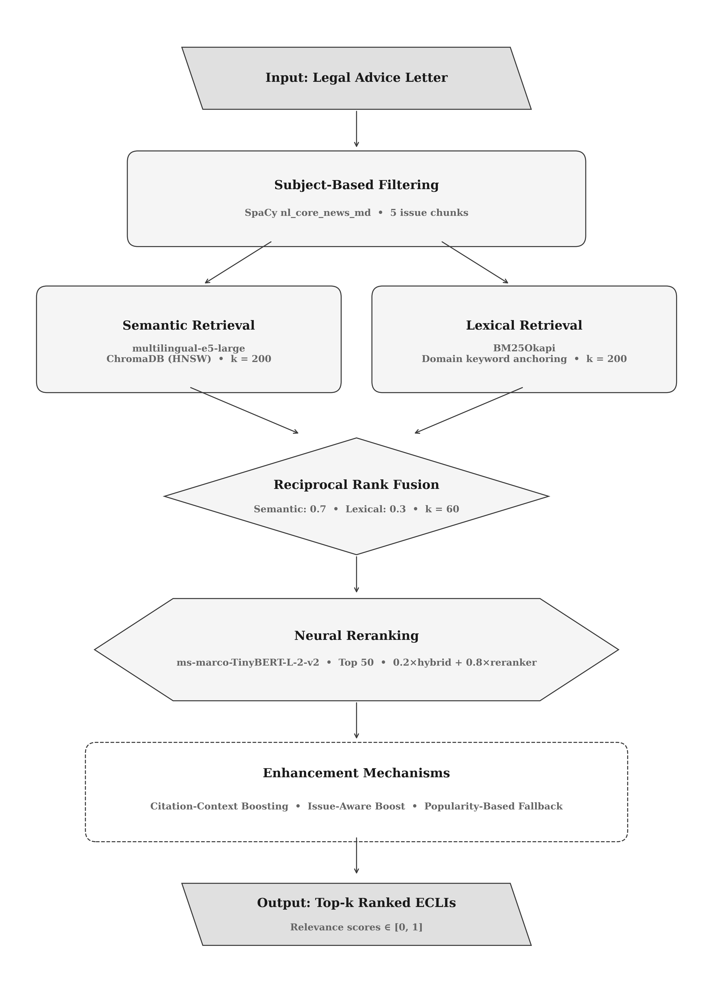

# CiteConnect: Legal Case Law Retrieval System

A hybrid retrieval system that links Dutch legal advice letters to relevant case law using ECLI (European Case Law Identifier) citations. Built with a multi-stage RAG (Retrieval-Augmented Generation) architecture combining dense semantic search, sparse lexical matching, neural reranking, and domain-specific enhancement mechanisms.



## Features

- **Hybrid Retrieval**: Combines dense semantic search (multilingual-e5-large) with sparse lexical search (BM25) using Reciprocal Rank Fusion
- **Neural Reranking**: Cross-encoder reranking with ms-marco-TinyBERT-L-2-v2 for fine-grained relevance scoring
- **Subject-Based Filtering**: Segments legal advice letters into thematic issues for targeted retrieval
- **Citation-Context Boosting**: Leverages historical citation patterns to improve retrieval accuracy
- **Popularity-Based Fallback**: Incorporates landmark case recognition based on citation frequency
- **Dutch Language Support**: Native Dutch language processing with multilingual models
- **Interactive Interface**: Streamlit-based web interface (CiteConnect) for legal professionals

## Requirements

- Python 3.12 (required for ChromaDB compatibility)
- 16GB RAM minimum
- ~5GB storage for models and indices
- GPU optional (supports MPS on macOS, CUDA on NVIDIA)

## Installation

```bash
# Clone the repository
git clone https://github.com/bchiusano/DSP-Project1.git
cd DSP-Project1

# Install dependencies
pip install pandas openpyxl langchain langchain-classic langchain-chroma \
    langchain-text-splitters langchain-huggingface langchain-community \
    chromadb openai sentence-transformers tiktoken huggingface_hub \
    flashrank rank-bm25 nlp spacy transformers torch

# Download Dutch language model
python -m spacy download nl_core_news_md

# Download embedding model (optional - auto-downloads on first run)
export HF_HUB_ENABLE_HF_TRANSFER=1
huggingface-cli download intfloat/multilingual-e5-large --local-dir ./models/intfloat
```

## Usage

### Web Interface

```bash
streamlit run app.py
```

### Programmatic Usage

```python
from test_rag_infloat_multilingual import LegalRAGSystem

# Initialize system
rag = LegalRAGSystem(initialize_summarizer=False)

# Query with a single letter
results = rag.query_single_letter(letter_text, approach="split")

# Results contain ranked ECLIs with relevance scores
for ecli, score in results[:10]:
    print(f"{ecli}: {score:.3f}")
```

### Batch Evaluation

```python
# Run evaluation on test set
rag = LegalRAGSystem(initialize_summarizer=False)
rag.run_evaluation(
    mode="sample",
    search_approach="split",
    num_rows=30,
    random_seed=40
)
```

## Architecture

The system implements a multi-stage hybrid retrieval pipeline:

1. **Input Processing**: Legal advice letter undergoes subject-based filtering, splitting into 5 thematic issue chunks using SpaCy Dutch NLP

2. **Parallel Retrieval**:
   - *Semantic*: multilingual-e5-large embeddings → ChromaDB (HNSW) → top 200 candidates
   - *Lexical*: BM25Okapi with domain keyword anchoring → top 200 candidates

3. **Fusion**: Reciprocal Rank Fusion (RRF) combines results with 70/30 semantic/lexical weighting

4. **Reranking**: ms-marco-TinyBERT-L-2-v2 cross-encoder reranks top 50 candidates

5. **Enhancement**: Citation-context boosting, issue-aware boosting, and popularity-based fallback adjust final scores

6. **Output**: Top-k ranked ECLIs with relevance scores normalized to [0, 1]

For detailed documentation on enhancement mechanisms (citation-context boosting, issue-aware boosting, popularity-based fallback), see [RAG_ENHANCEMENTS_README.md](RAG_ENHANCEMENTS_README.md).

## Configuration

Key hyperparameters in `test_rag_infloat_multilingual.py`:

| Parameter | Value | Description |
|-----------|-------|-------------|
| `SEARCH_K` | 200 | Candidates from each retrieval method |
| `RERANK_TOP_N` | 50 | Candidates passed to reranker |
| `MIN_SCORE` | 0.3 | Minimum relevance threshold |
| `RERANK_WEIGHT` | 0.8 | Reranker vs. hybrid score blend |
| Semantic weight | 0.7 | RRF fusion weight |
| Lexical weight | 0.3 | RRF fusion weight |

Domain keywords are configured in `resources/domain_config.py`.

## Evaluation Metrics

- **Recall@k**: Proportion of ground truth ECLIs in top-k results
- **MRR@k**: Mean Reciprocal Rank of first relevant result

Evaluation uses an 80/20 train-test split with fixed random seed (40) for reproducibility.

## Data

| Dataset | Description | Size |
|---------|-------------|------|
| Case law corpus | Dutch legal decisions with ECLI | 2447 cases |
| Advice letters | Annotated letters with ground truth citations | 567 letters |


## Acknowledgments

- Built with [LangChain](https://langchain.com/), [ChromaDB](https://www.trychroma.com/), and [HuggingFace](https://huggingface.co/)
- Embedding model: [intfloat/multilingual-e5-large](https://huggingface.co/intfloat/multilingual-e5-large)
- Reranker: [ms-marco-TinyBERT-L-2-v2](https://huggingface.co/cross-encoder/ms-marco-TinyBERT-L-2-v2) via FlashRank
